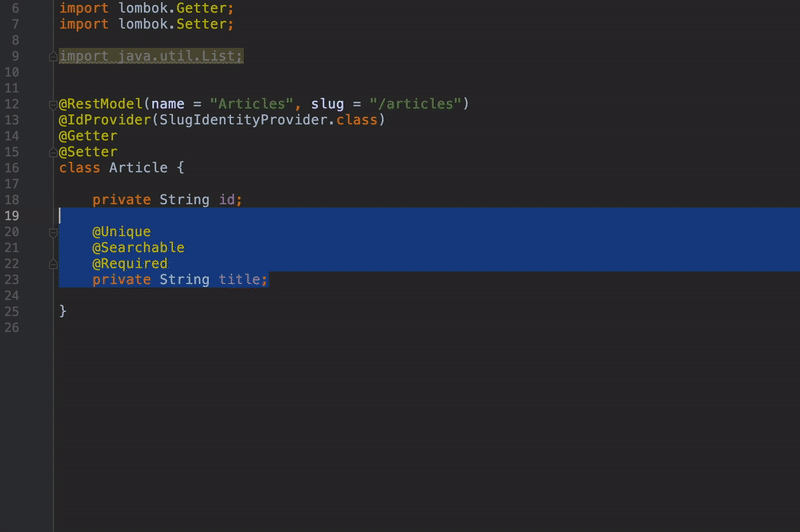

# Welcome to Elepy documentation!
Glad you made it!

### What is Elepy?

Elepy is a Headless Content Management Framework for Java & Kotlin developed by [Ryan Susana](https://ryansusana.com/). It is extremely customizable! The framework comes bundled with an admin control panel that lets you easily control your content.

It's able to handle complex models with ease.

# Quick Links
- [Quick Start](main/getting-started.md)
- [YouTube Guides](https://www.youtube.com/channel/UCzoUQe9eIzVl7r9NTIIuSGA)
