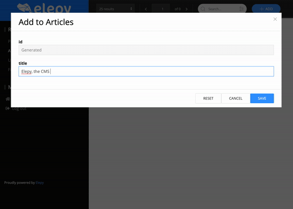

# Custom Functionality Annotations
This chapter is dedicated to annotations that change(or add to) the default functionality of Elepy.
# @Find, @Create, @Update and @Delete
This annotation marks that you are overriding the default functionality of one of the CRUD actions of Elepy.

You can define a handler and a required permission read more about that here:
- [Users & Permissions](core-functionality/users-permissions.md)
- [Handlers](core-functionality/handlers.md)

```java
@Find(findManyHandler = UserFindMany.class,
           findOneHandler = UserFindOne.class,
           requiredPermissions = "authenticated"
)
@Update(handler = UserUpdate.class,
            requiredPermissions = "authenticated")
@RestModel(...)
public class User {
    private long id;
}
```
___NOTE: by overriding default behaviour you will affect the CMS, so be careful___

# @Action
`@Action`s are extra pieces of code that you can add to your CMS.

For now, there are 2 types of actions:
- `ActionType.SINGLE`: Should only be executed on a single 
- `ActionType.MULTIPLE`:

Let's say you want to query for your article on Google, it's as simple as:

```java
@Action(name = "Find Article on Google",
        handler = FindOnGoogle.class,
        actionType = ActionType.SINGLE,
        //These are optional
        requiredPermissions = Permissions.AUTHENTICATED,
        method = HttpMethod.GET,
        path = "/find-on-google")
@RestModel(...)
class Article{
    private String id;
    private String title;
    
    // Getters & Setters
}
```

You would have to make a `FindOnGoogle` [handler](core-functionality/handlers.md), which can look like:
```java
public class FindOnGoogle implements ActionHandler<Article> {
    
    @Override
    public void handleAction(HttpContext context, Crud<Article> articles, ModelContext<Article> modelContext, ObjectMapper objectMapper) {
        var article = articles.getById(context.recordId())
                .orElseThrow(() -> new ElepyException("Article not found", 404));

        // Elepy's CMS handles Message.redirect(String) as an actual redirection
        context.response()
                .result(Message
                           .redirect("https://google.com/search?q=" + article.getTitle()));

        //A regular Message.of would return a modal in the CMS

    }
}
```

This results in the following:



# @ExtraRoutes
_Coming soon..._

## @Route
_Coming soon..._

# @DaoFactory
_Coming soon..._

# @IdProvider
This annotation refers to an `IdentityProvider`. An IdentityProvider provides ID's to items of a model on creation.
By default, the `DefaultIdentityProvider` is used.

Typical IdentityProviders:
- `HexIdentityProvider` - Provides a random hex string as ID. __only works on String ID's__
- `NumberIdentityProvider` - Provides a random number as ID.
- `PathIdentityProvider` - Provides a URI-friendly ID. __only works on String ID's__

```java
@IdProvider(PathIdentityProvider.clss)
@RestModel(...)
class Article{
    private String id;
}
```
