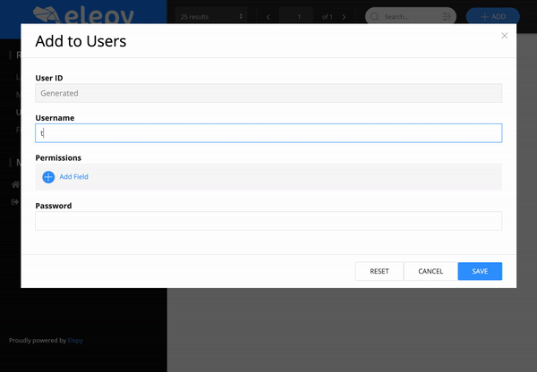

# Users & Permissions

_Gif displaying creation users with permissions_

# Users
Users are just special `@RestModel`s. By default when you spin up Elepy on a clean database, it triggers you to create an initial user.
This user is granted the 'owner' permission and can later be used to login. You can read more about permissions in the following chapter.
User's passwords are encrypted by the BCrypt algorithm before being saved into the database.

# Permissions
For security, Elepy uses a simple role-based access control. A user can be associated with many permissions.

You can create your own permissions by using your own Strings in [Handlers](core-functionality/handlers.md).

Special Permissions related to Elepy:
- `owner`
    - Only one owner can exist (unless you play around with the database)
    - Owners are granted super user access and have the permission of any other permission
- `authenticated`
    - Whenever a User is logged in, this permission is granted to the user
    - This is the default required permission for all `@Create`, `@Update`, `@Delete`, and `@Action` annotations
    - This is the default required permission for all non-GET routes generated by Elepy. 
- `files`
    - A user with this permission can upload files.
- `users`
    - A user with this permission can edit other users.