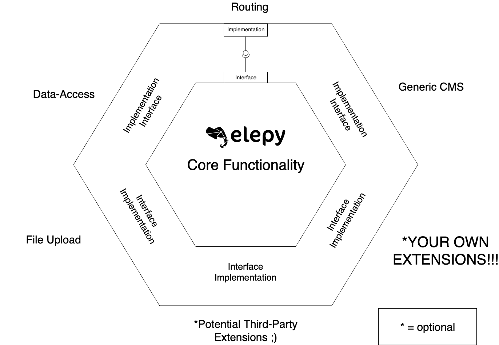

# Core Concepts {docsify-ignore-all}

This chapter describes the core concepts and ideologies of Elepy.

## Happiness & Freedom
Elepy empowers ___you___, the developer, first. 

- No faulty plugins
- No substantial learning curve 
- No limiting templates
- No drag-and-drop creation of Models, like the traditional Headless CMS

Just you, your __boilerplate-free__ code, and your __happy__ smile. ;)

## Annotation-based, Model-driven
___Models are everything in Elepy.___

You define your CMS based on the models you imagine and Elepy handles the boilerplate. [Defining your models are as easy as annotating a plain old Java object.](/getting-started.md)

## Hexagonal Architecture
Elepy makes use of a [hexagonal architecture](https://dzone.com/articles/hexagonal-architecture-what-is-it-and-how-does-it).
All of the ports(_or interfaces_) can be completely swapped out for another adapter(_or implementation_).
For all the main ports(except the Generic CMS) there are at least 2 different implementations:
- __Routing__: Sparkjava & Vert.x, Javalin soon to come.
- __Data-Access__: MongoDB & Hibernate, [covering a majority of popular databases](https://db-engines.com/en/ranking).
- __File Upload__: Local File Storage & GridFS(via MongoDB), more to come.

These adapters live in their own, separate modules. They all get integration tested with Elepy's test module. The ports live in the core module of Elepy.
Here is an image displaying the architecture behind Elepy.

